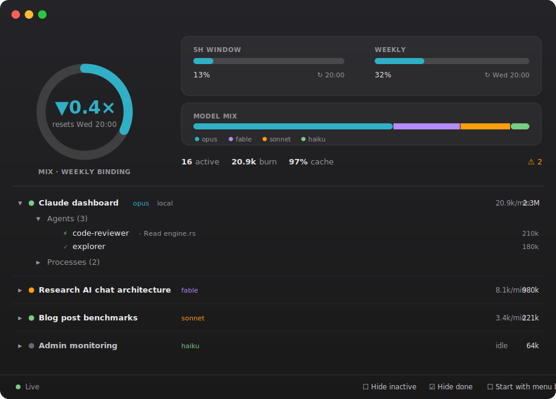

<p align="center"></p>

<h1 align="center">Redline</h1>

<p align="center">
Mission control for Claude Code.<br/>
Every session, every agent, every token — every machine.
</p>

<p align="center">
<a href="https://github.com/jagajaga/redline/actions/workflows/ci.yml"></a>
<a href="https://github.com/jagajaga/redline/releases"></a>
</p>

---

Claude Code will happily burn your entire 5-hour window while you're at lunch.
Sessions pile up, agents spawn agents, a server grinds all night — and the
first you hear is **"limit reached, resets at 03:00."**

Redline already knows. It was watching.

## Three faces, one daemon

A tiny background daemon (`ccwatchd`) tails `~/.claude`, computes rates, alerts
and the Governor, and serves it over a local socket. On top of that sit **three
views** — use whichever you like, together or alone.

### 🍎 Menu bar


The menu-bar icon is a **live burn-rate graph**, colored by how hard you're
pushing your limit. Click it for a popover:

- **The Governor** up top — throttle (`▲2.1×` / `▼0.4×`), which limit is
  binding, 5h and weekly **%**, both **reset times**, and a plain-language
  projection: *"weekly tokens gone: Wed Jul 8, 14:00"* (red if you're on track
  to hit it before it resets).
- **Actively-working sessions** — each a card you expand in place: model,
  tokens, cpu/ram, current action, and its **active subagents** (with their
  task + live rate). **Kill / Pause / Resume** on any of them.
- **⚙ Settings** — two independent knobs: **Limit** (what the number *is*:
  `5h` / `Weekly` / `Mix`, where Mix is whichever wall binds first) and
  **Menu bar shows** (the format: throttle / % / rate / nothing). Plus
  **Start with menu bar only** and **Start at login**.
- Footer buttons: **TUI** (opens the terminal view) and **Dashboard**.

### 🪟 Dashboard window



A native vibrancy window (SwiftUI). The **Governor** as a live ring for the
binding limit, a **both-limits card** with reset times + "hits ~… at this
pace", the **model mix**, and the fleet totals. Below, a **click-anywhere-to-
expand** list of every session revealing everything it's doing:

**actions** · **active agents** (nested, with model + burn) · **tasks** ·
**child processes** · **watchers** — plus Kill/Pause/Resume.

**Hide inactive** / **Hide done** filter the list. The Dock icon appears
**only while the window is open**; close it and Redline lives in the menu bar.

### 🖥 Terminal UI


The whole fleet in your terminal — burn, tokens, cpu/ram, activity, agents,
alerts. Run `ccwatch`, or hit **TUI** in the menu-bar popover.

| | | | |
|---|---|---|---|
| `/` jump anywhere | `d` details | `s` sort | `enter` expand |
| `k` kill | `p` `r` pause/resume | `f` hide idle | `x` hide done |

## The Governor

A fuel gauge that **learns your real plan limits from your own 429s** — both the
5-hour window *and* the weekly cap — re-measuring on every confirmed wall, so
upgrades *and* downgrades self-correct. Zero config.

- It shows the **binding** limit — whichever wall you'll hit first. `▲2.1×`
  means you're burning at 2.1× the pace that coasts you to reset (you'll hit it
  early); `▼0.4×` means you'll coast home with room to spare.
- Usage is metered in **Opus-equivalent tokens**, weighted per model, so the
  gauge stays honest across a Fable/Opus/Sonnet mix.
- Limit math counts **billable** tokens (input + output + cache-creation —
  what Anthropic's limits count); the per-session **burn rate you see is the
  actual work** (input + output), so it isn't drowned out by cache churn.

## What else it tracks

- 🖥 **Fleet view** — all sessions, all machines: burn, tokens, cpu/ram, last
  activity, the same titles Claude's UI uses.
- 🔍 **Live activity** — `✎ Edit engine.rs` · `⚙ cargo build 87%` — in-flight
  tool calls *and* real child processes, per session.
- 🤖 **Agents** — who spawned what, nested, with truthful running/done state.
  Even nested subagents (workflow-spawned, in git worktrees) get their tokens
  attributed and show as **active** while they burn.
- 🚨 **Leak alerts** — runaway loops, cache bleed, agent storms, sessions
  burning while "idle", servers gone dark.
- 🔪 **Kill switch** — kill / pause / resume from any surface, with confirmation.
- 🛰 **Remote machines, zero install** — one line of JSON; a python probe rides
  over ssh, nothing gets installed.

## Install

**The macOS app** (menu bar + dashboard window) — native SwiftUI, **macOS 14+**.
Grab `Redline-*.zip` from the
[latest release](https://github.com/jagajaga/redline/releases/latest), unzip,
drop `Redline.app` into `/Applications`, open it. It opens the dashboard window
by default and lives in the menu bar. The binary is unsigned, so the first
launch needs one of:

```sh
xattr -dr com.apple.quarantine /Applications/Redline.app
```

(or right-click → Open → Open). Flip **Start with menu bar only** to launch
tray-only, and **Start at login** to have it always there.

**Terminal UI only** — grab `ccwatch-*-macos-universal.tar.gz` from the same
release:

```sh
tar xzf ccwatch-*-macos-universal.tar.gz
mv ccwatch/ccwatch ccwatch/ccwatchd /usr/local/bin/   # or anywhere on PATH
ccwatch
```

**From source:**

```sh
cargo build --release && ./target/release/ccwatch   # daemon + TUI
swift build -c release --package-path app            # the macOS app
```

No setup. No accounts. No telemetry. The daemon starts itself and exits when the
last client disconnects.

## Remote machines

```json
// ~/.claude/ccwatch/remotes.json
[{ "name": "my-server", "kind": "ssh", "target": "user@host" }]
```

Needs ssh keys and python3 on the box. That's the whole setup. Remote sessions
land in the same views, killable over ssh, and a dead server becomes an alert —
not a silent gap.

## Tune

Everything is optional — Redline learns budgets from the wall. Budgets are in
**Opus-equivalent** tokens (Opus ×1, Fable ×2, Sonnet ×0.6, Haiku ×0.2) so a
tank stays honest as the mix shifts.

```toml
# ~/.claude/ccwatch/config.toml — all optional
#window_budget = 200_000_000  # 5h plan window; unset → learned from 429s
#week_budget   = 600_000_000  # weekly cap; unset → learned from limit markers
#weight_fable  = 2.0          # override a model weight if pricing shifts
terminal = "iTerm"            # terminal for the TUI button
burn_tokens_per_min = 40000   # where the menu-bar graph turns red
```

## Under the hood

```
~/.claude  ──┐                      ┌── ssh ── remote ~/.claude
             ▼                      ▼
          ccwatchd ── tails transcripts (new bytes only), watches pids,
             │        computes rates · alerts · the Governor
             ├────────────────┐   unix socket, JSON snapshots
             ▼                ▼
        ccwatch (TUI)   Redline.app (menu bar + dashboard window, SwiftUI)
```

Claude Code already writes everything worth knowing into `~/.claude`. Redline
just reads it well. Idle cost: ~0% CPU.
