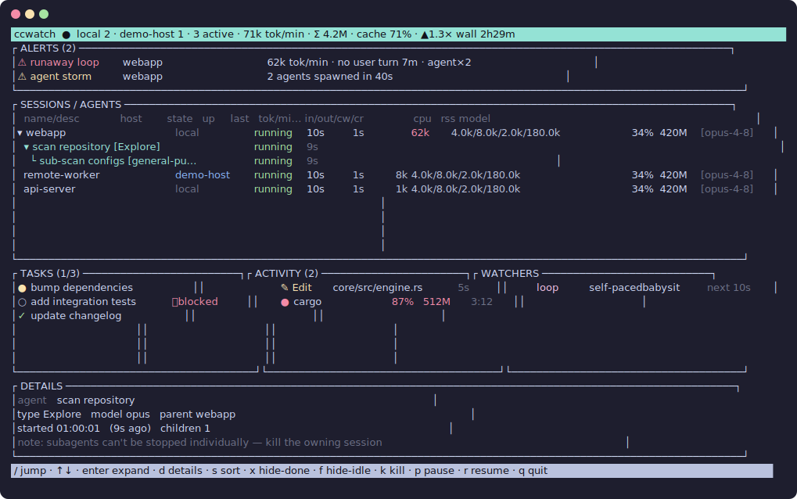
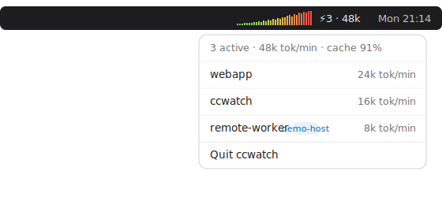

# ccwatch

A terminal dashboard that shows **everything Claude Code is running** — sessions,
tasks, agents (including nested subagents), and watchers (hooks, `/loop` /
`ScheduleWakeup` jobs, background commands) — and surfaces **where tokens are
being burned or leaking**.

It reads local Claude Code state under `~/.claude` (session registry, task
lists, and transcripts), accounts for token usage incrementally, samples live
process CPU/RSS, and flags leaks (runaway loops, cache bleed, zombie sessions,
agent storms). You can act on what you find — pause, resume, or kill a session,
kill a background process, or disable a hook — all with confirmation.

## Screenshots

### Terminal UI (`ccwatch`)



### macOS menu bar (`ccwatch-menubar`)

A live load graph rendered right in the menu bar — Retina-crisp 2× bars, colored
green→amber→red by **absolute burn vs. your configured threshold** (so a steady
moderate load stays green; red means you're actually burning). The dropdown has
alerts on top and a submenu per session with live details and **Pause / Resume /
Kill** actions (destructive ones confirmed via a native dialog, results as
notifications). Remote sessions get a `Cancel on <host>` action instead. It
auto-reconnects if the daemon restarts.



## Design

The full design is in
[`docs/superpowers/specs/2026-07-01-claude-code-observability-tui-design.md`](docs/superpowers/specs/2026-07-01-claude-code-observability-tui-design.md).

## Architecture

A Cargo workspace with a clean split so a future menu-bar client is an additive
crate, not a rewrite:

| Crate | Binary | Role |
|---|---|---|
| `core` | — | Data model, collectors, incremental token accounting, leak heuristics, IPC types, action executors. Pure logic, heavily unit-tested. |
| `daemon` | `ccwatchd` | Always-on collector. Owns the single engine, refreshes on file-change events (FSEvents) with a poll backstop, serves newline-delimited JSON over a Unix socket at `~/.claude/ccwatch/daemon.sock`. |
| `tui` | `ccwatch` | ratatui terminal client. Auto-spawns the daemon if absent, subscribes for pushed snapshots, renders, and drives actions. |

## Build & run

```sh
cargo build --release
./target/release/ccwatch          # launches the TUI (auto-spawns the daemon)
```

`ccwatchd --once` prints a single JSON snapshot and exits — handy for scripting:

```sh
./target/release/ccwatchd --once | jq '.totals'
```

### Keys

```
/        fuzzy jump to any session / agent / task / watcher by name
↑ ↓      move selection
enter    expand / collapse the selected session or agent
k        kill selected session   (SIGTERM → grace → SIGKILL, with confirm)
p / r    pause / resume session   (SIGSTOP / SIGCONT)
f        hide/show idle sessions
q        quit
```

Killing a background command targets just that pid; a `/loop` or subagent lives
inside a session process and can only be stopped by killing the owning session.

## Configuration

Optional `~/.claude/ccwatch/config.toml` overrides leak thresholds (see
`core/src/config.rs` for the keys and defaults), e.g.:

```toml
burn_tokens_per_min = 40000
runaway_no_user_secs = 300
cache_bleed_ratio = 0.2
```

## Token accounting

Burn rate is computed over billable tokens (input + output + cache-write),
**excluding cache reads** — cache reads are huge in volume but cheap, so
including them would make every healthy, well-cached session look like it's on
fire. Cache reads are tracked separately and feed the cache-bleed heuristic.
The cumulative "Σ total" figure in the top bar does include everything.

## Status

**Phase 1 (local) is complete and tested.** Phases 2 (remote via SSH + cloud
agents/routines) and 3 (macOS menu-bar client) are designed for in the spec and
the `Host` abstraction is already in the model, but are not yet implemented.

## Tests

```sh
cargo test --workspace
```

Covers transcript parsing, token math, each leak heuristic, session/task/hook
collection, incremental ingest (no double-counting), the action executors
(against real throwaway child processes), a full daemon IPC round-trip
(spawn → subscribe → snapshot → action), and TUI rendering via ratatui's
`TestBackend`.
